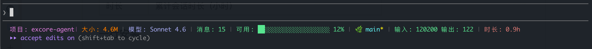

# claude-statusline

> [English](#english) · [中文](#中文)

一个为 [Claude Code](https://www.anthropic.com/claude-code) 设计的多信息状态栏：单行展示项目名、目录大小、模型、消息数、上下文用量进度条、Git 分支与脏标记、输入/输出 token、累计时长。

A multi-info status line for Claude Code. One row shows project name, directory size, model, message count, context usage bar, git branch (with dirty flag), input/output tokens, and total session duration.



---

## 中文

### 显示内容

```
项目: my-app | 大小: 4.6M | 模型: Sonnet 4.6 | 消息: 12 | 可用: ████░░░░░░░░░░░░░░░░ 20% | 🌿 main* | 输入: 12345 输出: 6789 | 时长: 1.5h
```

| 字段 | 说明 |
|---|---|
| 项目 | `workspace.project_dir` 的目录名 |
| 大小 | 项目目录大小（120 秒缓存一次，`du -sk`） |
| 模型 | `model.display_name`，可选通过 `models.conf` 映射为别名 |
| 消息 | 基于输入 token 增量启发式估算的会话内消息数 |
| 可用 | 上下文窗口剩余百分比的进度条 |
| 🌿 | Git 分支；带 `*` 表示工作树有未提交修改 |
| 输入/输出 | 累计 token 数 |
| 时长 | 累计会话时长（小时） |

### 一行安装

```bash
curl -fsSL https://raw.githubusercontent.com/258468639/claude-statusline/main/install.sh | bash
```

安装脚本会：

1. 下载 `statusline.sh` 到 `~/.config/claude-statusline/statusline.sh`
2. 备份 `~/.claude/settings.json` 为 `.bak`
3. 用 `jq` **合并**写入 `statusLine` 字段（不会覆盖你已有的配置）

安装完成后**重启 Claude Code** 或开启新会话即可看到状态栏。

### 手动安装

```bash
git clone https://github.com/258468639/claude-statusline.git
cp claude-statusline/statusline.sh ~/.config/claude-statusline/statusline.sh
chmod +x ~/.config/claude-statusline/statusline.sh
```

然后在 `~/.claude/settings.json` 里加：

```json
{
  "statusLine": {
    "type": "command",
    "command": "/Users/<you>/.config/claude-statusline/statusline.sh"
  }
}
```

### 依赖

- `jq`（必需）
- `bc`（必需，用于浮点运算）
- `git`（可选，没有就不显示分支）

macOS：`brew install jq bc`  
Debian/Ubuntu：`apt install jq bc`

### 自定义

#### 切英文

```bash
export CLAUDE_STATUSLINE_LANG=en
```

#### 模型 ID 别名映射

如果你用代理把 Claude 模型名换成了其他厂商的模型（如 `glm-5.1` / `DeepSeek-V4`），可以在 `~/.config/claude-statusline/models.conf` 写映射：

```
claude-opus-4-8    = glm-5.1
claude-sonnet-4-6  = DeepSeek-V4
claude-haiku-4-5   = kimi-k2.6
```

样例在 `examples/models.conf`。

#### 环境变量

| 变量 | 默认 | 说明 |
|---|---|---|
| `CLAUDE_STATUSLINE_LANG` | `zh` | `zh` / `en` |
| `CLAUDE_STATUSLINE_CACHE_DIR` | `$XDG_CACHE_HOME/claude-statusline` | 缓存目录 |
| `CLAUDE_STATUSLINE_CONFIG_DIR` | `$XDG_CONFIG_HOME/claude-statusline` | 配置目录 |

### 卸载

```bash
mv ~/.claude/settings.json.bak ~/.claude/settings.json
rm ~/.config/claude-statusline/statusline.sh
```

### License

[Apache-2.0](LICENSE)

---

## English

### What it shows

```
Proj: my-app | Size: 4.6M | Model: Sonnet 4.6 | Msgs: 12 | Free: ████░░░░░░░░░░░░░░░░ 20% | 🌿 main* | in: 12345 out: 6789 | Time: 1.5h
```

| Field | Source |
|---|---|
| Proj | basename of `workspace.project_dir` |
| Size | project directory size (`du -sk`, cached 120s) |
| Model | `model.display_name`, optionally aliased via `models.conf` |
| Msgs | heuristic message count from input-token delta |
| Free | context window remaining bar |
| 🌿 | git branch; `*` means dirty |
| in/out | cumulative tokens |
| Time | cumulative session duration in hours |

### Install (one line)

```bash
curl -fsSL https://raw.githubusercontent.com/258468639/claude-statusline/main/install.sh | bash
```

The installer downloads `statusline.sh`, backs up `~/.claude/settings.json` to `.bak`, then merges a `statusLine` entry — your other settings are preserved.

Restart Claude Code afterwards.

### Manual install

```bash
git clone https://github.com/258468639/claude-statusline.git
cp claude-statusline/statusline.sh ~/.config/claude-statusline/statusline.sh
chmod +x ~/.config/claude-statusline/statusline.sh
```

Then in `~/.claude/settings.json`:

```json
{
  "statusLine": {
    "type": "command",
    "command": "/Users/<you>/.config/claude-statusline/statusline.sh"
  }
}
```

### Dependencies

- `jq` (required)
- `bc` (required, float math)
- `git` (optional)

macOS: `brew install jq bc` · Debian/Ubuntu: `apt install jq bc`

### Customize

**English labels:**

```bash
export CLAUDE_STATUSLINE_LANG=en
```

**Model ID aliases** — drop a file at `~/.config/claude-statusline/models.conf`:

```
claude-opus-4-8    = glm-5.1
claude-sonnet-4-6  = DeepSeek-V4
```

See `examples/models.conf`.

**Env vars:**

| Var | Default | Meaning |
|---|---|---|
| `CLAUDE_STATUSLINE_LANG` | `zh` | `zh` / `en` |
| `CLAUDE_STATUSLINE_CACHE_DIR` | `$XDG_CACHE_HOME/claude-statusline` | cache dir |
| `CLAUDE_STATUSLINE_CONFIG_DIR` | `$XDG_CONFIG_HOME/claude-statusline` | config dir |

### Uninstall

```bash
mv ~/.claude/settings.json.bak ~/.claude/settings.json
rm ~/.config/claude-statusline/statusline.sh
```

### License

[Apache-2.0](LICENSE)
